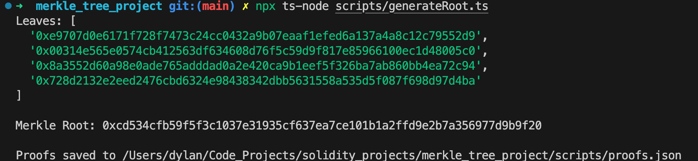
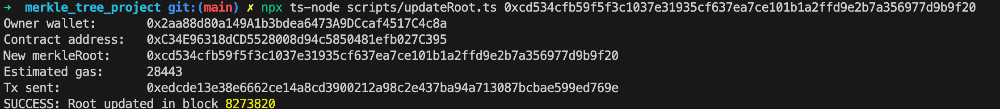
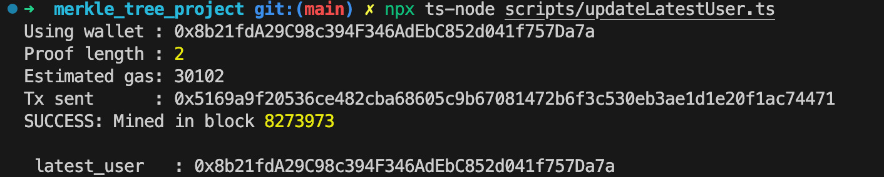

## 目录结构

```
├── script
│   └── Deploy.sol
├── scripts
│   ├── generateRoot.ts
│   ├── proofs.json
│   ├── updateLatestUser.ts
│   └── updateRoot.ts
├── src
│   └── MerkleApp.sol
├── test
│   └── MerkleAppTest.sol
```

## 合约信息

Sepolia Contract Address: `0xC34E96318dCD5528008d94c5850481efb027C395`  
Transaction Hash: `0x7376792fb22488f9b38d343e2c60a5c832456caba31f214449b6189706d7e834`

## scripts 运行实例

- scripts/generateRoot.ts: 生成 `MerkleRoot` 以及`proofs.json`

```bash
npx ts-node scripts/generateRoot.ts
```



---

- scripts/updateRoot.ts: owner 修改`MerkleRoot`

```bash
npx ts-node scripts/updateRoot.ts 0xcd534cfb59f5f3c1037e31935cf637ea7ce101b1a2ffd9e2b7a356977d9b9f20
```



---

- scripts/updateLatestUser.ts: user 修改 `latest_user`,

```bash
npx ts-node scripts/updateLatestUser.ts
```


